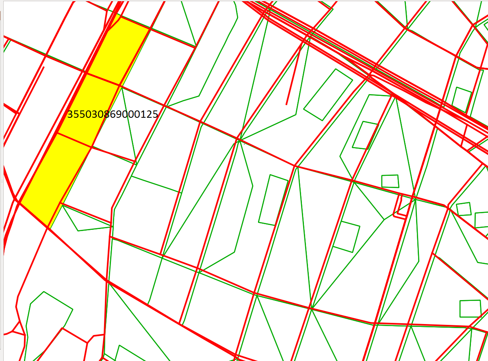
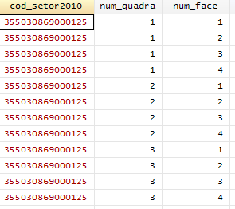
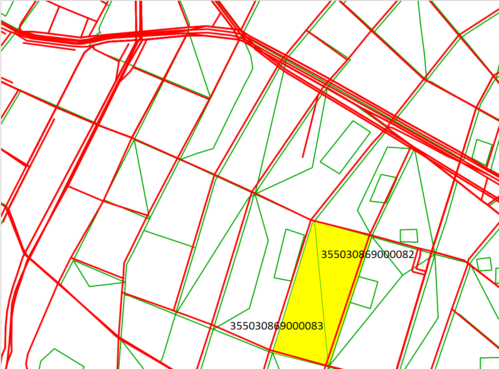
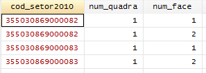
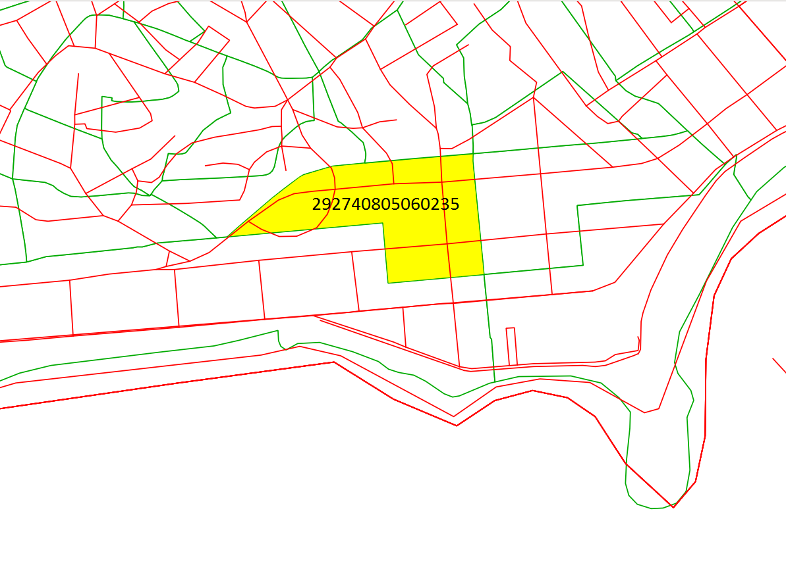

This page illustrates how the Enumeration Districts (ED, Setor Censitario) polygons relate to OSM streets. 

Bellow:
- Enumeration Districts = Green
- OSM streets a= red

Enumeration Districts are defined to contain 250-350 households, respecting, as best as possible, street boundaries. Thus, the EDs size depends on how dense areas are. In a lower density area, with mostly larger houses, an ED can span serveral city blocks. In a denselly populated area, dominated by apartment buildings, an ED can take only a block, or even less. 

This is reflected in CNEFE, where household addresses are indexed by "city block" and "city block face" codes, which are subdivisions of EDs. 

The images bellow describes some of theese cases. 
Theese images are from the municipality of Sao Paulo -SP, where geometries of EDs and OSM-Streets are somewhat consistent (in other areas they can be quite inconsistent)

## Case 1: ED spans several blocks (most common case)

ED-polygos vs OSM-Streets:

REPRESENTATION in CNEFE:

## Case 2: ED spans lest than one block (denser areas)

ED-polygos vs OSM-Streets:

REPRESENTATION in CNEFE:

## Case 3: ED polygons are displocated 

This exaple is from downtown Salvador

Notice how the ED polygons are dislocated notheast from the undelying OSM-Streets (suposebly the "true" location).  
A person at OSM-dev IRC suggested that the projection for the ED layer may be wrong. Maybe it could actualy be SAD69 (4618) instead of the recorded SIRGAS2000 (4674). I tryed to Update_GeometrySRID() but that did not work (as documented in [this gis.stackexchange question](http://gis.stackexchange.com/questions/154389/updating-srid-update-geometrysrid-does-not-alter-polygons-when-it-should))

